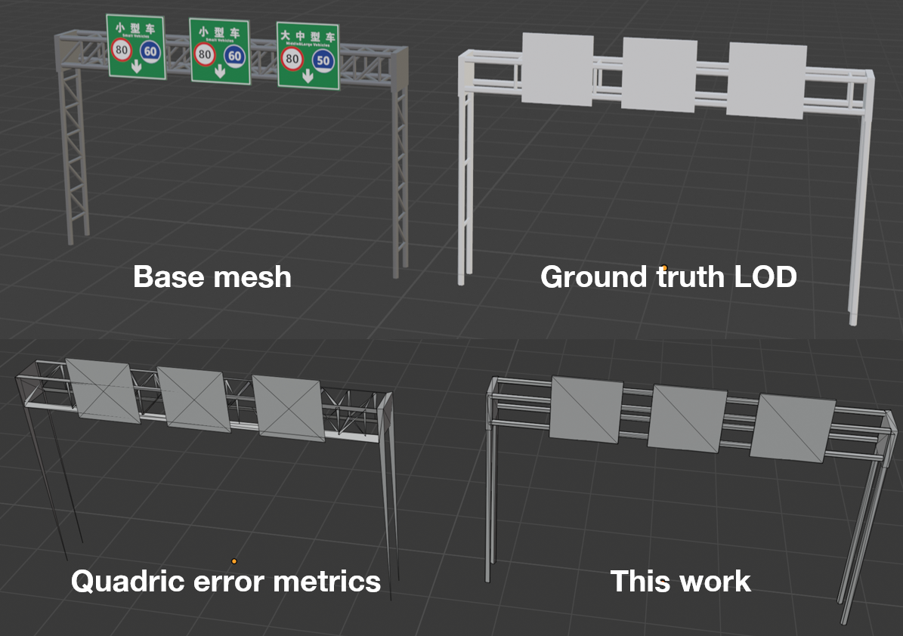

# quadric_lod
Generates LOD mesh based on quadric error metric with heuristics. See the report document for details.

### Usage 
`python decimate.py [-h] [-a] [-b BOUNDARY] [-t THRESHOLD] [-o OUTPUT] [-p]
                   [-s SCAN]
                   input n`

### Positional arguments
  `input`                 Path to input mesh file, the OBJ file should be trianglulated
                        and does not contain edges, normals, or texture coordinates
                        
  `n`                     Number of decimation iteration

### Optional arguments:
  `-h, --help`           show help message and exit
  
  `-a, --area`            Turn off surface area heuristic
  
  `-b BOUNDARY, --boundary BOUNDARY`
                        Boundary constraint factor, use 0 to turn off
                        
  `-t THRESHOLD, --threshold THRESHOLD`
                        Pair decimation threshold relative to mean extent of
                        the mesh
                        
  `-o OUTPUT, --output OUTPUT`
                        Path to output file
                        
  `-p, --plot`            Plots loss history
  
  `-s SCAN, --scan SCAN`  Scan the entire loss curve, save model every [`-s`]
                        steps after [`n`] steps

### Requirements
numpy (for linear algebra)

matplotlib (for plotting loss curve)

tqdm (for progress bar)

